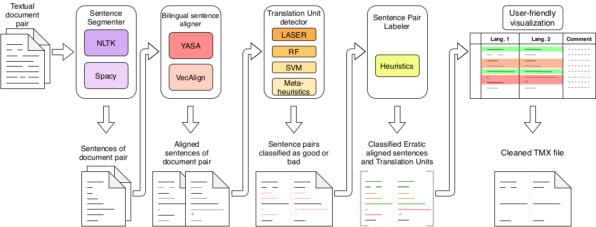
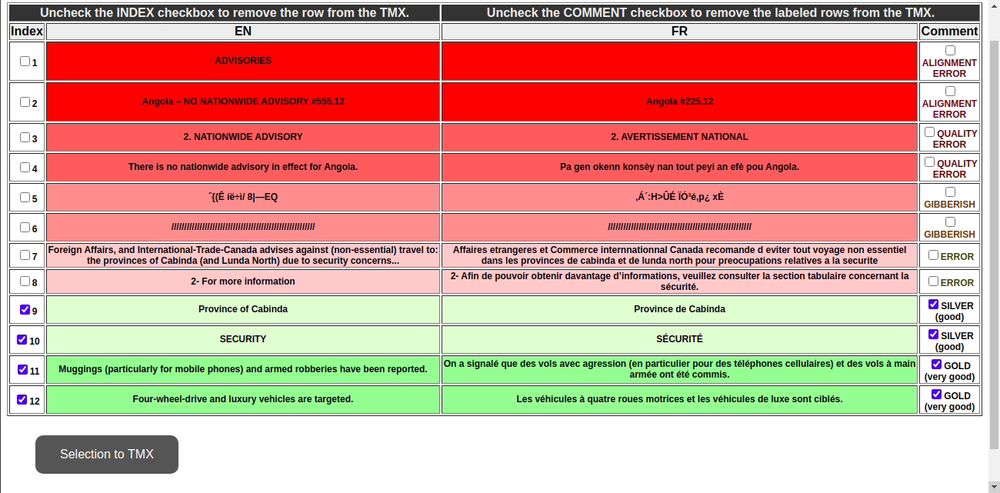

# Project description
**OSTI** is an open-source tool to process and visualize a pair of bilingual documents (original and translation) into automatically labeled sentence pairs.  For a translation professional it can be used as a human-accessible quality evaluation tool, as a pre-processing step for human annotation as well as an intermediate step to populate a Translation Memory. **OSTI** is made to process English-French or French-English bitexts. Any other language pair requires modifications to the code. 

## Dependencies and installation

### OSTI requirements

The library works with python 3.6+ and the depencies can be installed by EITHER executing the setup.py file using python (recommended) :

```bash
python setup.py
```

OR using the 'pip' library by typing the following command in the terminal :

```bash
pip install -r requirements.txt
```

followed by :
```python
import nltk
nltk.download('punkt')
exit()
```

### Inlcuded tools

The **YASA** tool (http://rali.iro.umontreal.ca/rali/?q=en/yasa) is provided in its compiled form and has only been tested to work on (multiple) Debian-based Linux distributions.


### External Tools instructions
For an optimal use of the aligners and classifiers of this system, it is recommended to install the **VecAlign** and
**LASER** toolkits. These can be downloaded freely from :
* **VecAlign** : 
  * https://github.com/thompsonb/vecalign/archive/master.zip 
  * or  https://github.com/thompsonb/vecalign
* **LASER** : 
  * https://github.com/bhardwaj1230/LASER---CorpusCleaning-Classification
  * or https://github.com/facebookresearch/LASER/archive/master.zip
  * or  https://github.com/facebookresearch/LASER

Follow the instructions to install each of them :
* **VecAlign** : https://github.com/thompsonb/vecalign/blob/master/README.md
* **LASER** : https://github.com/facebookresearch/LASER/blob/master/README.md)

**IMPORTANT!!!** If you choose **NOT** to install them directly into the *resources/* folder, you **must** replace the values for *'path to vecalign'* and *'path to laser'* (in the *configuration.json* file, under *'options'*) so they match the correct corresponding paths. 

We HIGHLY recommend that the **VecAlign** toolkit be installed or copied into the *resources/vecalign/* folder,
making sure to not delete the *resources/vecalign/vecalign\_wrap.py* file 
(which can also be found in *resources/wrap/vecalign\_wrap.py*).

**IMPORTANT!!!** If you choose **NOT** to install the **VecAlign** toolkit in *resources/vecalign* then, you will need to copy
the *resources/wrap/vecalign\_wrap.py* file into the folder it is installed on **AND** change the explicit relative import path in
line 16 of the *bin/txt2tmx.py* file to match its correct location.

## Use

## Quick start

The current state of the code requires to call the *main.py* file using the python command in the terminal :

```bash
python main.py -insrc path/to/the/source.file -intrgt path/to/the/target.file -lsrc en -ltrgt fr \[-other_flags\]
```

The available argument flags are :
* *-insrc* or *--inputsource* : (required), path to the Source file in plain text format (*.txt*) using *utf-8* encoding.
* *-intrgt* or *--inputtarget* : (required), path to the Target file in plain text format (*.txt*) using *utf-8* encoding.

* *-lsrc* or *--langsource* : (optional, English \[en\] by default), two letter code (ISO 639-1) for the language of the Source file.
* *-ltrgt* or *--langtarget* : (optional, French \[fr\] by default), two letter code (ISO 639-1) for the language of the Target file.

* *-ali* or *--aligner* : (optional, YASA \[yasa\] by default), string indicating what aligner should the script use. Accepted values : *yasa*, *vecalign*.
* *-cls* or *--classifier* : (optional, LASER \[laser\] by default), string indicating what classifier should the script use. Accepted values : *laser*, *randomforest*, *svm*, *metaheuristic*.

* *-tmx* or *--outputtmx* : (optional, unspecified by default), path to the intermediary tmx file. If the file is unspecified, the system will overwrite the temporary files at *tmp/aligned.tmx* and *tmp/aligned_all_labeled.tmx*. If a file is specified, then the system will create a file with a name ending in "*_aligned.tmx*" in the same folder. This file contains the data from the specified tmx file and the new data classified as GOOD. This "*_aligned.tmx*" file serves as a ready-made Translation Memory, requiring no further annotation. Another file with a name ending in "*_all_labeled.tmx*" will be created in the same folder. It will contain both GOOD and BAD sentence pairs and serve as reference as base for the html file (see below).
* *-html* or *--outputfolder* : (optional, unspecified by default), path to the html file that serves as user platform. It is advised to leave this argument undefined, in which case, the system will overwrite the existing file at *html/index.html*. The user can open the file *html/index.html* in any web browser to manually select what sentences or classes of sentences should end up in the final tmx file.


## System pipeline visualization



## Examples

```
python main.py -insrc ./test.en -intrgt ./test.fr

python main.py -insrc ./tourism_advisory.txt -intrgt ./avertissement_touristique.txt

python main.py -insrc ./tourism_advisory.txt -intrgt ./avertissement_touristique.txt -lsrc en -ltrgt fr

python main.py -insrc ./avertissement_touristique.txt -intrgt ./tourism_advisory.txt -lsrc fr -ltrgt en

python main.py -insrc ./tourism_advisory.txt -intrgt ./avertissement_touristique.txt -lsrc en -ltrgt fr -ali yasa -cls laser

python main.py -insrc ./tourism_advisory.txt -intrgt ./avertissement_touristique.txt -lsrc en -ltrgt fr -ali vecalign -cls metaheuristic

python main.py -insrc ./tourism_advisory.txt -intrgt ./avertissement_touristique.txt -lsrc en -ltrgt fr -ali yasa -cls randomforest -tmx ./tourism_translation_memory.tmx

python main.py -insrc ./tourism_advisory.txt -intrgt ./avertissement_touristique.txt -lsrc en -ltrgt fr -ali yasa -cls svm -tmx ./tourism_translation_memory.tmx -html ./to_be_hand_picked.hmtl
```

## Output

For source and target files containing 900 sentences each, the running time can take up to 5 minutes (measured on a personal computer with 30Gb of RAM, a 12-core CPU and a GeForce GT 1030 GPU) depending on the aligner and classifier used.

After *main.py* finishes running, an early version of the final tmx will appear in the specified location (*tmp/aligned.tmx* by default) and an html file will be created in the specified location (*html/index.html* by default). The user can then open the html file (with the web browser of his/her choice) to verify the accuracy of the classification and correct it if needed. 
The check-boxes in the *Index* column (left) allow to select and deselect by row and the check-boxes in the *Comment* column (right) allow to select and unselect all rows with the same annotation/class.
A button on the bottom of the html page will allow to save the final tmx file to the location of his/her choice.




## Citing
If you use OSTI in your research, please cite [article](article url).
```
bibtex
```

## Contacts

[David Alfonso-Hermelo](http://www-etud.iro.umontreal.ca/~alfonsda/), Laboratoire en Recherche Appliquée en Linguistique Informatique (RALI), Université de Montreal, Qc, Canada (david_dot_alfonso_dot_hermelo_at_gmail_dot_com)

[Shivendra Bhardwaj](https://www.linkedin.com/in/shivendra-bhardwaj-911a7038/), Laboratoire en Recherche Appliquée en Linguistique Informatique (RALI), Université de Montreal, Qc, Canada and National Research Council Canada (CNRC/NRC), Ottawa, On, Canada (shivendra_dot_bhardwaj_at_umontreal_dot_ca)

[Philippe Langlais](https://www.iro.umontreal.ca/~felipe/new-home/frontal.php?page=resume.html), Laboratoire en Recherche Appliquée en Linguistique Informatique (RALI), Université de Montreal, Qc, Canada (felipe_at_iro_dot_umontreal_dot_ca )

